# csudalatos miktorik kezdőlépések

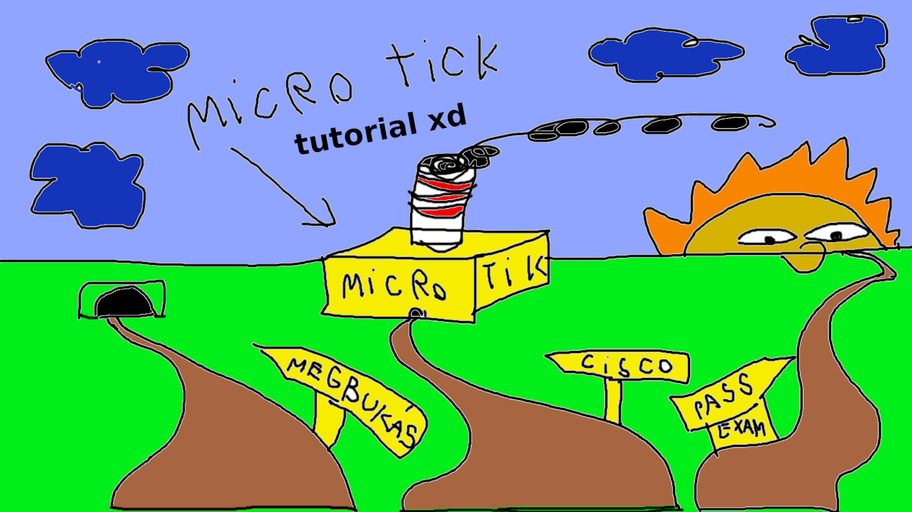

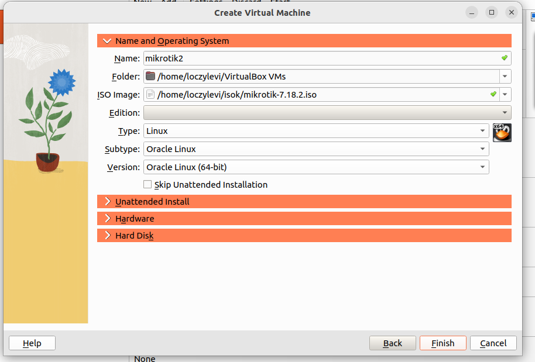

### name: opcionális akár skibidi is lehet | válassz ki egy mikrotik iso fáljt nyilván -no shit sherlock | 
## FONTOS valamié' typenál csak linuxt fogadd el és lehetöleg 64 bites legyen mert ugye nem kökorszakban élünk

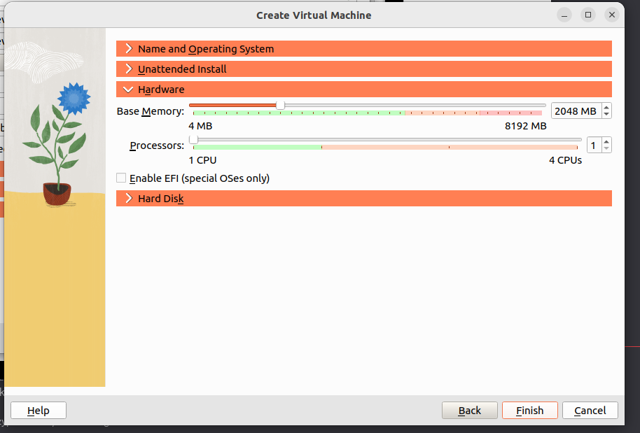

### adjá neki 2048 Mb-t mert szereti ha zsirral kenik | CPU? - Abbol egy van csak mert csöves kolisoknak nem telik többre (pont a mondat végére? -informatikusok vagyunk helló)
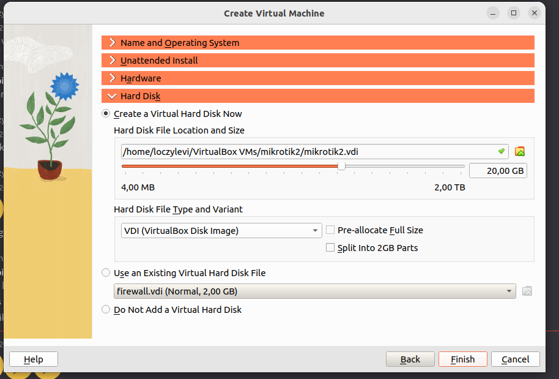

### 20 gb ha windows servernek elég akkor ennek is punk tum
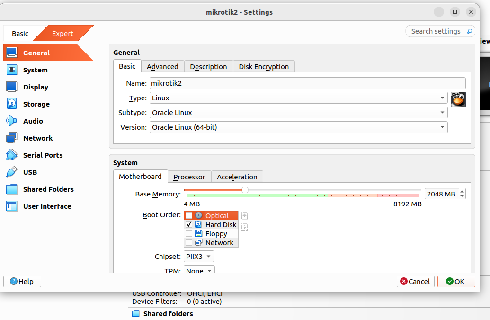

### győződj meg róla hogy ezek vannak beállitva skibidi flopyt ved ki mert az 1990-ben még lehet hogy meta volt most már pendrive a goated
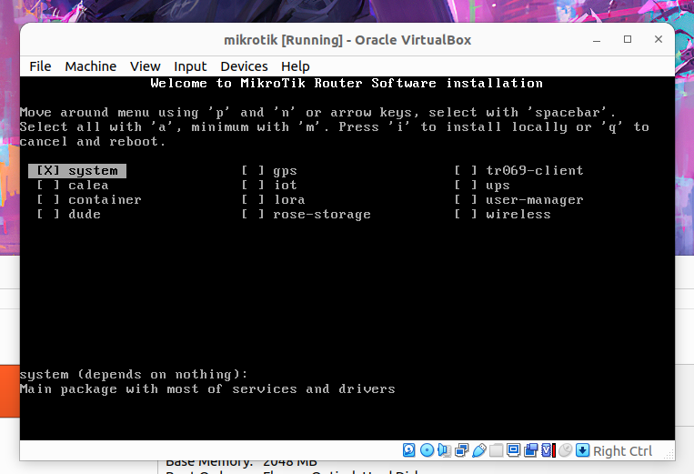

### "i" betü mint istall (oda van irva xd)
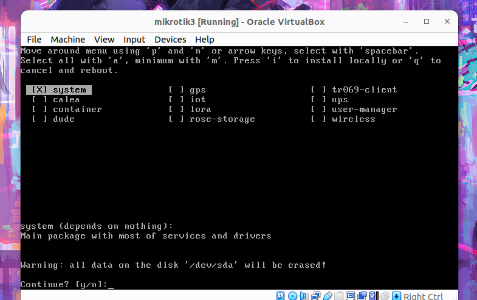

### nyomjál "z" betüt mert angol billenytű xddd
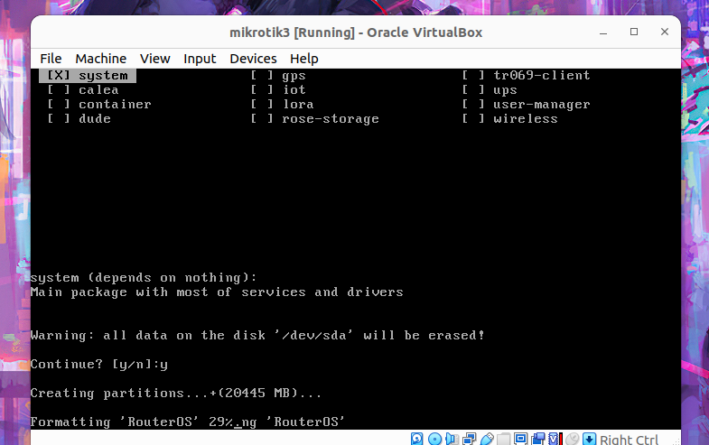

### várj a telepitésre GYÁÁÁÁÁÁÁÁÁÁÁÁÁÁÁá
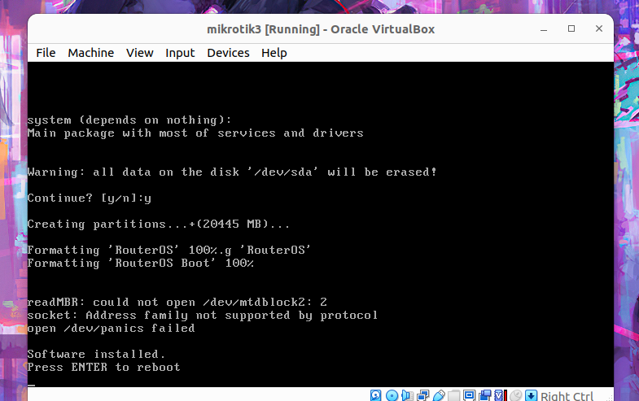

### ha sigma vagy nyomj entert
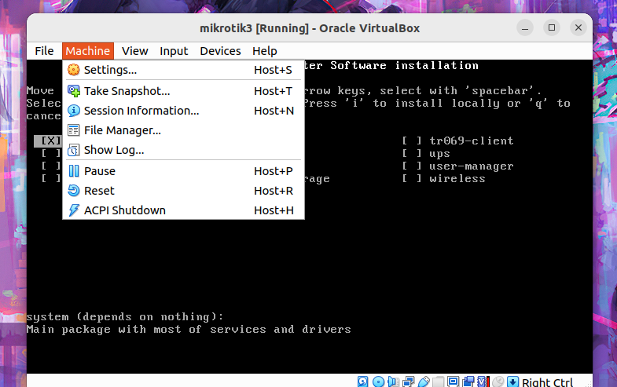

### ezután FONTOS rész ez a vicces koma nevén szólitva mikrotik addig nem bootol be mig el nem távolitjuk a telepitő isot 
## VAGYIS Machine --> Settings
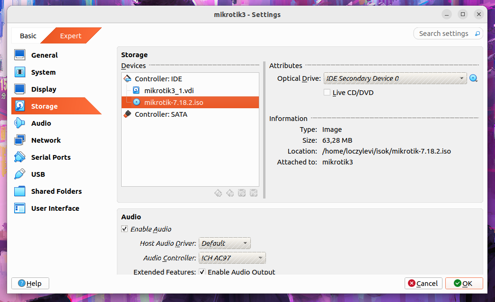

### jobb oldalt kék kör
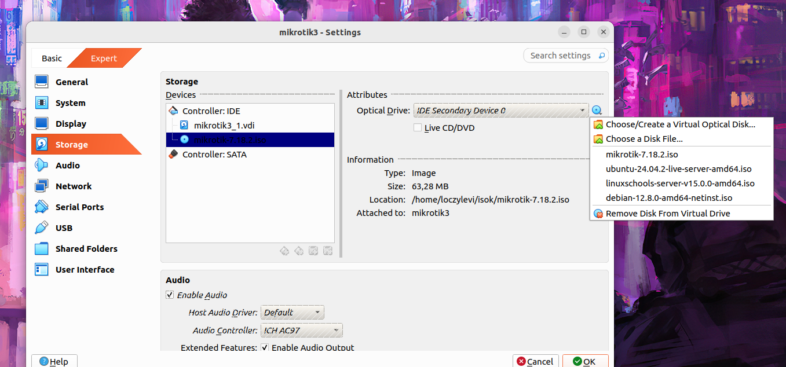

### legalul van olyan hogy remote ez valami angolszász jövevény szó hogy eltávolitás I guess
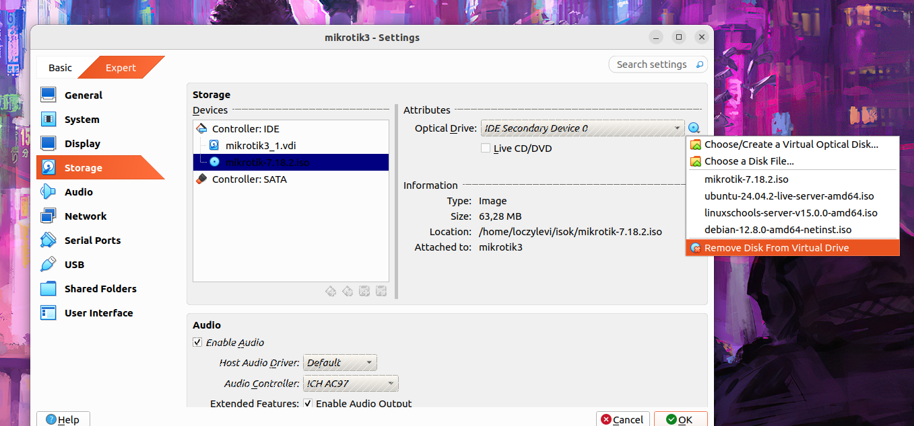

### kattinstunk is rá xd
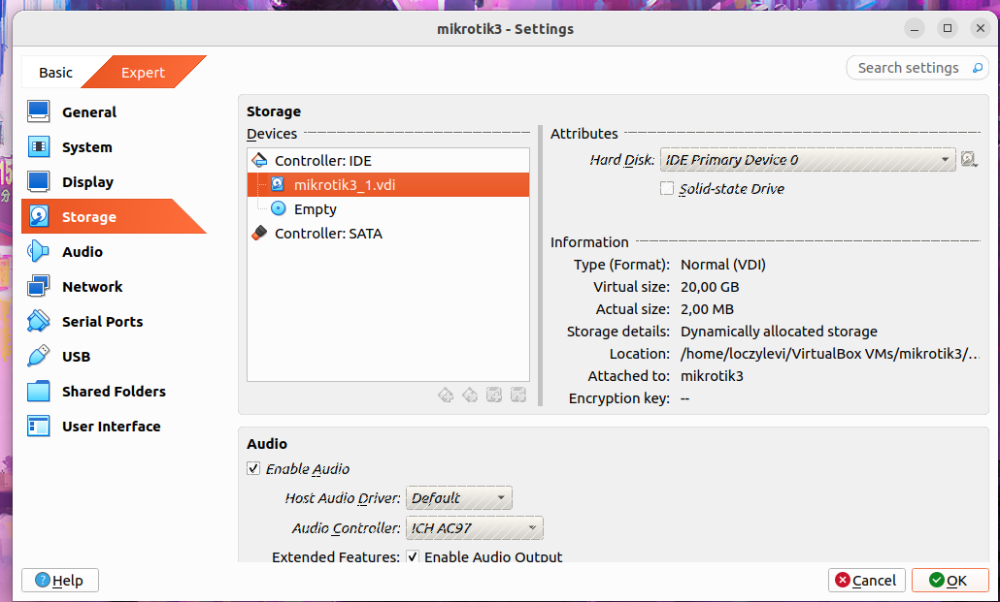

### OK
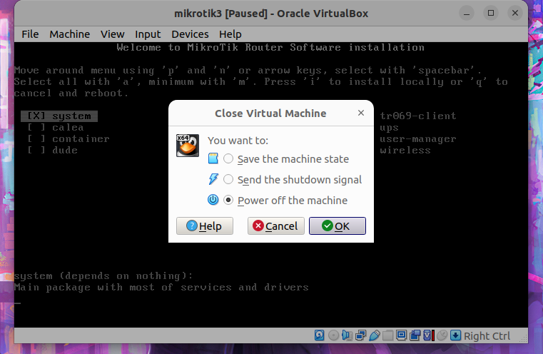

### kapcsold le a bolondost
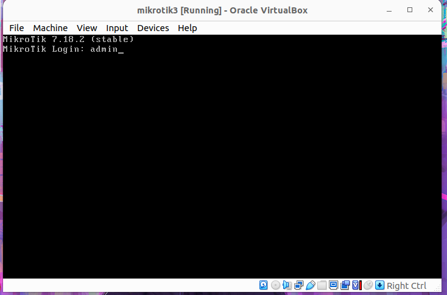

### default user name kreativ módón: "admin"
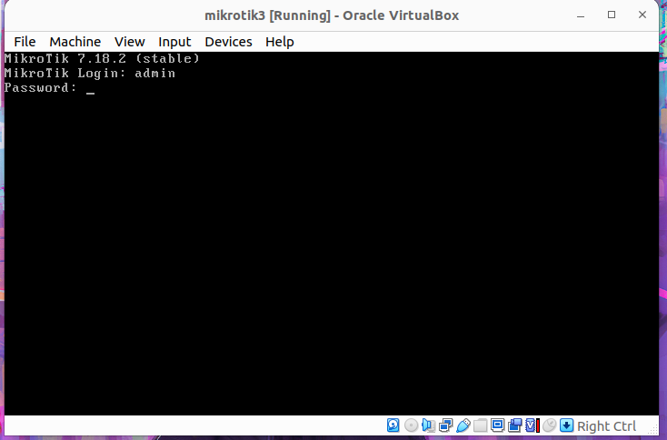

### jelszó nincs mert az overated vagyis csak szimplán NYOMJ ENTERT
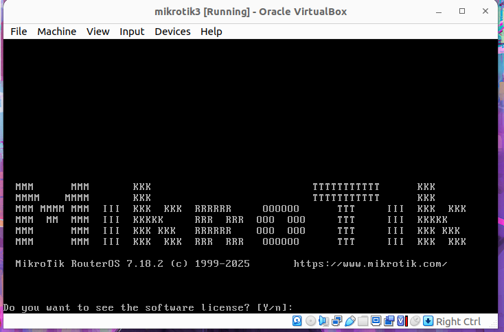

### license??? Miért olvasnád el? 2025 van ha az vann benne hogy eladod a lelked a sátánnak akkor meg nem tük mindegy? ki olvas licenset hell nah
## Nyomj "n" betüt
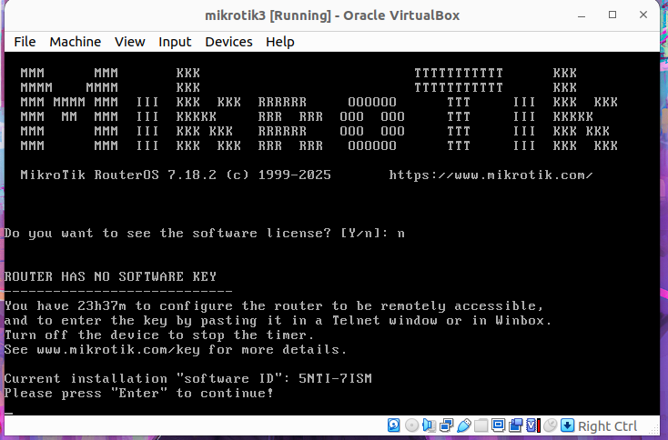

### ENTER
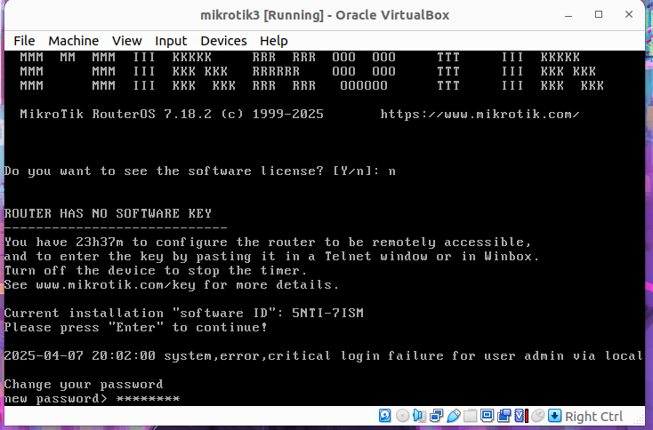

### csinálj passwordot mert etikus hackerek leszünk

### ja igen ez nem linux szóval tanulj meg egy új op rendszert fel konfigolni hajrá :3 👍

